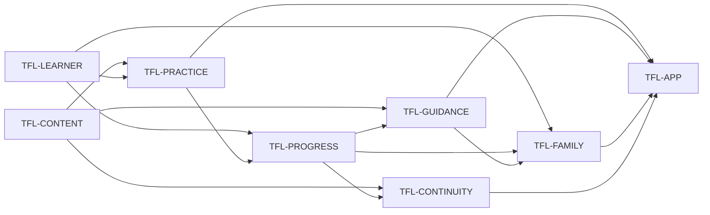

# LearningQuest identity graph

This graph records the durable identities of the LearningQuest family learning
PWA. Cite the `TFL-*` IDs. The destination is [vision.md](vision.md); this file
is not a roadmap, source-status ledger, metric, or claim that a candidate is
deployed or live.

One colloquial name has one row and one fate (`live`, `dead`, or
`rename-to:<ID>`). The table is the authority. The picture uses the same IDs
and the same Depends-on edges. A picture that omits or invents an edge is a
defect.

The shipped behavioral oracle is the static application in `index.html`, the
question and content-pack JSON, `manifest.webmanifest`, `sw.js`, and the
executable checks in `scripts/validate.mjs` and
`tests/mobile-shell.spec.mjs`. Roadmap labels and planned curriculum cards are
not identity evidence.

## Graph

Edges point from prerequisite to consumer. The registry below is the exact
textual edge list.

## Registry

| ID | Identity | Fate | Depends on | Done when |
| --- | --- | --- | --- | --- |
| `TFL-CONTENT` | Supply validated learning content | `live` | — | `questions.json` provides the required school-practice question bank, while `content-packs/registry.json` resolves the checked-in Traditional HK Chinese, Mandarin, Maths Foundation, and Life in the UK packs to their declared schemas and activity renderers. `npm run validate` rejects missing files, invalid identifiers, missing required fields, duplicate or under-covered governed questions, and private names in the product shell. Pack `passMarkPercent` remains mock schema, not customer-facing exam proof. A planned domain/card, registry label without valid pack data, school-specific promise, official-exam-readiness claim in customer-facing pack copy, or inline second copy of governed pack data fails this node. |
| `TFL-LEARNER` | Choose a local learner and practice purpose | `live` | — | The person using the browser can switch among the shipped generic learner profiles, choose a stage and learning goal, and see the active mission and recommendations update. Practice history keys remain distinct per selected profile. Stage/goal preferences are honestly browser-level; the profiles are not described as created accounts, authenticated identities, or protected child records. |
| `TFL-PRACTICE` | Complete a content-backed practice activity | `live` | `TFL-CONTENT`, `TFL-LEARNER` | The required question bank supports mixed or subject/difficulty/skill-filtered timed MCQs with locked answers, correctness, explanations, results, and review. Results may show correct/total and percent; they must not sell a pack pass-mark, PASSED/Not-yet label, or official-exam-readiness claim as exam proof. Pack `passMarkPercent` remains scoring and review-schedule internals. Valid shipped packs expose their governed activity shapes: Chinese flashcards/matching/comparison and optional browser speech, Maths answer entry with strategy feedback and weak-skill rotation, and Life in the UK starter, timed, weak-topic, review-queue, trend, and scenario practice. A missing optional pack shows its recovery state without disabling the required question practice or other valid packs. Placeholder cards and browser speech availability are not accepted as completed practice. |
| `TFL-PROGRESS` | Preserve bounded per-learner practice evidence | `live` | `TFL-LEARNER`, `TFL-PRACTICE` | A completed or governed partial activity writes a sanitized history entry under only the active learner's browser-local key, bounded to the eight most recent entries, and the app restores the supported activity metadata after reload/import. Subject results, weak skills, mock attempts, and the Life in the UK review schedule read from those local records without moving an entry to another learner or fabricating an attempt from an unanswered activity. |
| `TFL-GUIDANCE` | Turn saved evidence into the next practice | `live` | `TFL-CONTENT`, `TFL-PROGRESS` | Stage/goal selection and available-pack metadata produce curriculum recommendations; saved results can reprioritize weak subjects, skills, or topics and open the matching available practice. Empty history produces a labeled baseline action. The recommendation names the evidence it used. Learner-journey surfaces — recommendations plus Life in the UK catalog, result, trend, drill, and scenario copy — never present a heuristic, XP, streak, planned pack, pass-target display, PASSED/Not-yet label, or official-exam-readiness claim as proof of learning. |
| `TFL-FAMILY` | Provide an honest same-browser family coaching view | `live` | `TFL-LEARNER`, `TFL-PROGRESS`, `TFL-GUIDANCE` | The coach overview, local learner comparison, and follow-up action are derived only from histories saved for the generic profiles on the current browser; an action switches to the named local profile before opening practice. The shipped private-name regression check stays green, no progress is automatically published or uploaded, and the UI does not represent profile switching as authentication, parental authorization, or isolation from another person with browser access. |
| `TFL-CONTINUITY` | Reopen and manually transfer local learning state | `live` | `TFL-CONTENT`, `TFL-PROGRESS` | On a browser where service-worker registration and installation succeed, `sw.js` caches the app shell, required question bank, manifest, registry, and shipped pack files and serves cached GETs when the network is unavailable. Local history survives an ordinary reload. Export creates an explicit versioned JSON backup for the selected learner; import validates and bounds its history before restoring that selected learner. Service-worker failure remains non-blocking online. No account recovery, background upload, automatic cross-device sync, merge, or conflict-resolution claim is made. |
| `TFL-APP` | Deliver the family learning PWA journey | `live` | `TFL-PRACTICE`, `TFL-GUIDANCE`, `TFL-FAMILY`, `TFL-CONTINUITY` | In a mobile-sized supported browser, a person can open the LearningQuest shell without horizontal overflow, choose learner/stage/goal, start an available practice, receive feedback, observe the selected learner's saved result and next action, and use the honest same-browser coach and continuity paths. `manifest.webmanifest` exposes the standalone PWA identity. Passing source checks, producing an image, reaching a URL, a leftover `sylphx.toml` `[[services]].type` key, GitHub Pages `200`, or doctrine deploy note `tart-duo-uvt9` does not close this identity and does not prove an installed, deployed, offline, or live journey. |

## Source grounding

- `index.html` owns the learner selector, mission setup, practice renderers,
  feedback, browser-local history, recommendations, coach views, and explicit
  progress export/import behavior.
- `questions.json`, `content-packs/registry.json`, and the referenced pack JSON
  own the content consumed by the shipped activity surfaces.
- `manifest.webmanifest` and `sw.js` own installable identity and cache-first
  core-asset behavior. They do not create a remote sync service.
- `scripts/validate.mjs` owns static schema and private-name regression checks;
  `tests/mobile-shell.spec.mjs` owns the browser interaction oracle exercised by
  `npm test` and `npm run smoke:mobile`.
- `server.js` is a static file server. Its SPA fallback is not an account,
  progress, curriculum, or child-safety authority.
- `sylphx.toml` dest is one typeless Apps `[[services]]` row named `web`
  (service name, not a type discriminator), built from the repo `Dockerfile`,
  health path `/`. Leftover `type` (`web` / `service` / `worker`) and
  `build_only` are leftover, not dest; Apps typed-refuses a `type` key.
  A typeless sold row does not close `TFL-APP`. This file is customer deploy
  intent, not live proof.

## Reading rules

1. A dependency is a product prerequisite, not a scheduling convenience.
2. Fate is destination intent, not observed status. A `live` identity remains
   undone until its Done-when holds.
3. Done-when text is an oracle, not current node state.
4. A new subject label is not an identity until valid content reaches a
   governed practice surface with feedback and evidence handling.
5. Browser-local profiles and manual JSON transfer are not identity, access
   control, cloud durability, or sync.
6. This graph does not authorize merge, release, deployment, or a live claim.

## Release boundary (GOV-017)

Declared 2026-08-31 per company release law ([owner `standards/release-control-plane.md`](https://github.com/SylphxAI/owner/blob/main/standards/release-control-plane.md)). Docs declaration
of current truth only. This is a family product under the TseFamily
organisation; company delivery vocabulary does not override the plain
boundary below.

- **Public probe.** The cheapest falsifiable customer-visible proof at this
  product's boundary is the LearningQuest shell itself — a person opens the
  deployed static app, sees the learner/stage/goal selector, and starts a
  question-backed practice. The only documented publicly reachable surface is
  the GitHub Pages preview `https://tsefamily.github.io/tse-family-learning/`
  from `main`, which the README scopes as a preview, not production
  ("GitHub Pages is not production. A reachable URL is not the product
  contract"). No customer domain exists (`Ordinary: none`); whether the Sylphx
  product path (`tart-duo-uvt9`) currently holds a deployed, publicly
  locatable runtime is Unknown — the doctrine deploy note is not a public
  locator.
- **Owned manifest/migration writers.** Deployment uses the normal Sylphx
  product path for project `tart-duo-uvt9`, driven by this repo's
  `sylphx.toml`: one typeless `[[services]]` row named `web` (service name,
  not a type discriminator), built from the repo `Dockerfile` (health path
  `/`). Leftover `type` (`web` / `service` / `worker`) and `build_only` are
  leftover, not dest; Apps typed-refuses a `type` key. A typeless sold row
  does not close `TFL-APP`, cut live, mutate Apps GitOps, or invent a public
  customer URL. CI (`.github/workflows/ci.yml`) validates, builds, and
  runs the Playwright mobile smoke on PRs and merge groups. GitHub Pages
  publishes the preview surface from `main`. Migration writer: none — the
  product is a static app with no database and no migration step.
- **Consumed receipts.** GitHub Actions check runs and merge-group receipts
  (CI validation/build/smoke), GitHub Pages deployment receipts for the
  preview, and Sylphx product-path deployment receipts for `tart-duo-uvt9`.
  No company Apps/Journal/Compute/Identity/Commerce receipts are consumed:
  the app is browser-local by design.
- **Runtime effects.** A static file server (`server.js`, SPA fallback) serves
  the app in the Sylphx deployment path; in the user's browser, `sw.js` runs a
  cache-first service worker and learner history lives in browser-local
  storage. No server-side state, database, worker, or scheduled job exists.
- **Forbidden writes.** No account, remote progress writer, public profile,
  chat, social-sharing, or automatic sync path (vision family/data boundary;
  `TFL-CONTINUITY`); progress crosses browsers only by explicit manual JSON
  export/import. `server.js`'s SPA fallback is not an account, progress,
  curriculum, or child-safety authority. Private family names and
  school-specific promises must not become product data (`TFL-CONTENT`
  private-name check). CI, a deployment record, or a reachable URL must never
  be sold as an installed, offline, or live learning journey (`TFL-APP`).
  Leftover `[[services]].type` (`web` / `service` / `worker`) and
  `build_only` are leftover, not dest; Apps typed-refuses a `type` key. A
  typeless sold row does not close `TFL-APP`, cut live, mutate Apps GitOps,
  dest-expand GitHub Pages `200` as `TFL-APP` Done, or treat doctrine deploy
  note `tart-duo-uvt9` as a public locator.
