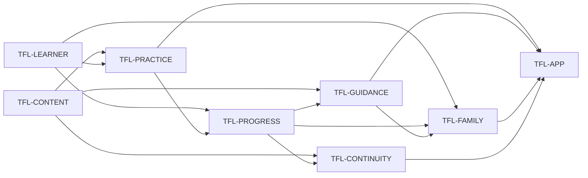

# LearningQuest capability graph

This graph records the stable product responsibilities of the LearningQuest
family learning PWA. Cite the `TFL-*` IDs. The destination is
[vision.md](vision.md); this file is not a roadmap, source-status ledger, metric,
or claim that a candidate is deployed or live.

The shipped behavioral oracle is the static application in `index.html`, the
question and content-pack JSON, `manifest.webmanifest`, `sw.js`, and the
executable checks in `scripts/validate.mjs` and
`tests/mobile-shell.spec.mjs`. Roadmap labels and planned curriculum cards are
not capability evidence.

## Graph

Edges point from prerequisite to consumer. The registry below is the exact
textual edge list.

## Registry

| ID | Capability | Depends on | Done when |
| --- | --- | --- | --- |
| `TFL-CONTENT` | Supply validated learning content | — | `questions.json` provides the required school-practice question bank, while `content-packs/registry.json` resolves the checked-in Traditional HK Chinese, Mandarin, Maths Foundation, and Life in the UK packs to their declared schemas and activity renderers. `npm run validate` rejects missing files, invalid identifiers, missing required fields, duplicate or under-covered governed questions, and private names in the product shell. A planned domain/card, registry label without valid pack data, school-specific promise, or inline second copy of governed pack data fails this node. |
| `TFL-LEARNER` | Choose a local learner and practice purpose | — | The person using the browser can switch among the shipped generic learner profiles, choose a stage and learning goal, and see the active mission and recommendations update. Practice history keys remain distinct per selected profile. Stage/goal preferences are honestly browser-level; the profiles are not described as created accounts, authenticated identities, or protected child records. |
| `TFL-PRACTICE` | Complete a content-backed practice activity | `TFL-CONTENT`, `TFL-LEARNER` | The required question bank supports mixed or subject/difficulty/skill-filtered timed MCQs with locked answers, correctness, explanations, results, and review. Valid shipped packs expose their governed activity shapes: Chinese flashcards/matching/comparison and optional browser speech, Maths answer entry with strategy feedback and weak-skill rotation, and Life in the UK starter, timed, weak-topic, review-queue, trend, and scenario practice. A missing optional pack shows its recovery state without disabling the required question practice or other valid packs. Placeholder cards and browser speech availability are not accepted as completed practice. |
| `TFL-PROGRESS` | Preserve bounded per-learner practice evidence | `TFL-LEARNER`, `TFL-PRACTICE` | A completed or governed partial activity writes a sanitized history entry under only the active learner's browser-local key, bounded to the eight most recent entries, and the app restores the supported activity metadata after reload/import. Subject results, weak skills, mock attempts, and the Life in the UK review schedule read from those local records without moving an entry to another learner or fabricating an attempt from an unanswered activity. |
| `TFL-GUIDANCE` | Turn saved evidence into the next practice | `TFL-CONTENT`, `TFL-PROGRESS` | Stage/goal selection and available-pack metadata produce curriculum recommendations; saved results can reprioritize weak subjects, skills, or topics and open the matching available practice. Empty history produces a labeled baseline action. The recommendation names the evidence it used and never presents a heuristic, XP, streak, planned pack, or pass-target display as proof of learning or exam readiness. |
| `TFL-FAMILY` | Provide an honest same-browser family coaching view | `TFL-LEARNER`, `TFL-PROGRESS`, `TFL-GUIDANCE` | The coach overview, local learner comparison, and follow-up action are derived only from histories saved for the generic profiles on the current browser; an action switches to the named local profile before opening practice. The shipped private-name regression check stays green, no progress is automatically published or uploaded, and the UI does not represent profile switching as authentication, parental authorization, or isolation from another person with browser access. |
| `TFL-CONTINUITY` | Reopen and manually transfer local learning state | `TFL-CONTENT`, `TFL-PROGRESS` | On a browser where service-worker registration and installation succeed, `sw.js` caches the app shell, required question bank, manifest, registry, and shipped pack files and serves cached GETs when the network is unavailable. Local history survives an ordinary reload. Export creates an explicit versioned JSON backup for the selected learner; import validates and bounds its history before restoring that selected learner. Service-worker failure remains non-blocking online. No account recovery, background upload, automatic cross-device sync, merge, or conflict-resolution claim is made. |
| `TFL-APP` | Deliver the family learning PWA journey | `TFL-PRACTICE`, `TFL-GUIDANCE`, `TFL-FAMILY`, `TFL-CONTINUITY` | In a mobile-sized supported browser, a person can open the LearningQuest shell without horizontal overflow, choose learner/stage/goal, start an available practice, receive feedback, observe the selected learner's saved result and next action, and use the honest same-browser coach and continuity paths. `manifest.webmanifest` exposes the standalone PWA identity. Passing source checks, producing an image, or reaching a URL does not by itself prove an installed, deployed, offline, or live journey. |

## Source grounding

- `index.html` owns the learner selector, mission setup, practice renderers,
  feedback, browser-local history, recommendations, coach views, and explicit
  progress export/import behavior.
- `questions.json`, `content-packs/registry.json`, and the referenced pack JSON
  own the content consumed by the shipped activity surfaces.
- `manifest.webmanifest` and `sw.js` own installable identity and cache-first
  core-asset behavior. They do not create a remote sync service.
- `scripts/validate.mjs` owns static schema and private-name regression checks;
  `tests/mobile-shell.spec.mjs` owns the browser interaction oracle exercised by
  `npm test` and `npm run smoke:mobile`.
- `server.js` is a static file server. Its SPA fallback is not an account,
  progress, curriculum, or child-safety authority.

## Reading rules

1. A dependency is a product prerequisite, not a scheduling convenience.
2. Done-when text is an oracle, not current node state.
3. A new subject label is not a capability until valid content reaches a
   governed practice surface with feedback and evidence handling.
4. Browser-local profiles and manual JSON transfer are not identity, access
   control, cloud durability, or sync.
5. This graph does not authorize merge, release, deployment, or a live claim.
